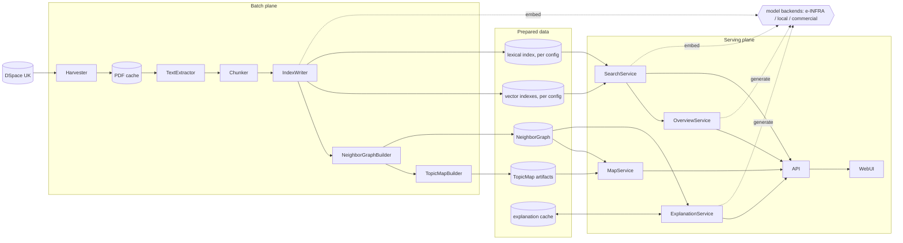

# Architecture

How the system is put together and why. Choices between alternatives live in
[design decision records](decisions/); questions that experiments must answer first are
collected at the end. Renaming a component here means renaming it in code and in the
thesis text too.

The document follows the data: first how a thesis gets into the system, then how
a query is answered, then how the two generated features work. Storage and
configuration details come after that.

## The picture

Data flows left to right: the batch plane produces prepared data, the serving plane
turns it into answers. Solid arrows are data flow; dotted arrows are model calls.

The stores in the middle are logical; their physical layout (Postgres schemas, files)
is under Storage. Builders read the vector index to compute their outputs; those read
edges are omitted for legibility, the pipeline order implies them. Model backends are
external systems reached through small interfaces (see Model providers).

## How a thesis gets in

1. **Harvester** syncs with the DSpace library API on a schedule: new theses, errata,
   takedowns. Nothing is added by hand (UC10). Each pass is a recorded SyncRun; every
   change creates a new document version, and downstream steps react to version changes.
2. The PDF lands in the **PDF cache** (sizing and eviction under Storage).
3. **TextExtractor** produces plain text into the catalog. DSpace publishes its own
   extracted text next to each PDF (the TEXT bundle); whether to reuse it is an open
   question.
4. **Chunker** cuts the text into passages sized for the embedding model, respecting
   sentence boundaries.
5. **IndexWriter** builds both halves of the search index: chunk vectors (embedded
   through the configured EmbeddingProvider) and the lexical index with Czech
   lemmatization. The lexical index defaults to chunk-level too, so both branches rank
   the same units and can feed passages to the overview; indexing whole documents
   instead is part of the lexical open question. Also derives one vector per thesis
   (construction is an open question).
6. **NeighborGraphBuilder** finds each thesis's top-k most similar theses (k around 20
   to 50) and stores only those edges. All pairs would be billions; the graph is a few
   million edges, and it defines which pairs can ever get an explanation.
7. **TopicMapBuilder** projects thesis vectors to 2D, clusters, labels the clusters and
   exports versioned static artifacts that MapService serves as-is.

Contract for the whole pipeline: incremental (touch only changed versions), idempotent
(any step safe to re-run), resumable (per-thesis processing state lives in the catalog).
The orchestration mechanism is deliberately undecided until the pipeline shape settles.

## How a query is answered

1. The query runs through both branches of the hybrid search: the **semantic branch**
   embeds it (using the query prompt the active model requires) and searches the vector
   index; the **lexical branch** lemmatizes it and searches the lexical index. Lexical
   matching without lemmatization is useless in Czech, so the lexical index needs
   proper Czech analysis from the start.
2. Reciprocal rank fusion merges the two chunk rankings, results aggregate to theses,
   metadata filters apply (UC3), snippets come from the matching chunks.
3. Which sources run and how they combine is a **SearchStrategy**. A strategy references
   a set of ranking sources and a fusion; fusion does not care how many rankings it
   merges. Variants: semantic only, lexical only, hybrid, an **ensemble** of several
   embedding configurations fused together with the lexical branch, and later hybrid
   with reranking. Strategies are configuration, comparable against each other (UC11).

## Generated content

Both generative features follow the same sequence: retrieve, generate, verify.

**Overview (UC8):**

1. Retrieve top passages for the question through SearchService (full hybrid).
2. Deduplicate per thesis, cap the context size.
3. The generation model answers only from the numbered passages, citing one on every claim.
4. A verifier checks every claim against its cited passage. Unsupported claims are
   dropped or the answer is regenerated; if retrieval found nothing solid, the answer
   honestly says so.
5. The complete verified answer returns at once (no streaming), so nothing shown is
   later retracted. Answers may be cached by normalized question, search setup and model.

**Similarity explanation (UC5):**

1. The user opens an edge of the NeighborGraph (from a thesis detail or the map).
   Only graph edges can be asked about, which bounds the space of requests.
2. **ExplanationService checks the explanation cache** (key: both thesis versions plus
   the explanation model). Hit: serve stored text, which is the common case for
   anything viewed before.
3. Miss: gather representative chunks of both theses, have a configurable model
   (default: a smaller one than the overview uses) describe what the works share,
   verify the claims the same way as overview, store, serve. First viewer waits
   a few seconds, everyone after reads the cache.
4. Invalidation: a new version of either thesis drops the pair's cached explanations;
   switching the active search setup drops the whole cache.

Cost therefore scales with what people actually view rather than with corpus size.

## Storage

One PostgreSQL instance with pgvector, split into schemas with single-writer ownership:

| Schema | Writer | Contents |
| --- | --- | --- |
| `catalog` | Harvester, TextExtractor | theses, metadata, extracted text, document versions, sync runs, processing state |
| `index_<config>` | IndexWriter | chunks, chunk vectors, lexical index, thesis vectors; one schema per retrieval configuration |
| `artifacts` | graph and map builders | NeighborGraph edges, TopicMap versions |
| `cache` | serving plane | explanation cache, overview cache |

Extracted text stays in the database: about 20 GB for the whole university, and it
belongs transactionally to metadata and indexes. The **PDF cache** is the one store
outside the database, and it is only a cache. The application never serves
PDFs (results link to DSpace); local copies exist so extraction and chunking can be
re-run without repeatedly downloading tens of thousands of files from a repository that
already suffers under scraping traffic from others. Measured on a 549-document sample
(September 2026): median PDF 1.6 MB, mean 4.7 MB, tail to 200 MB; the 120+ thousand
item corpus lands around 400 to 700 GB, extracted text 10 to 30 times smaller. Once
extraction is stable, PDFs can be evicted and re-fetched per file (say after an erratum).

## Retrieval configurations

A **retrieval configuration** bundles the embedding model, chunking parameters and
lexical setup. Vectors, indexes, NeighborGraph and TopicMap are all built per
configuration, and several exist side by side. That serves two purposes: comparing
configurations (UC11), and **ensembling** them, where a SearchStrategy fuses rankings
from several configurations at query time.

One asymmetry to keep in mind: search and the NeighborGraph can be ensembled (rankings
fuse), but the TopicMap cannot, because it needs one geometric space to project. The map
is always built from one designated configuration.

The **active search setup** (the set of configurations plus the strategy) is what
generation runs on; changing it drops the generation caches.

## Model providers

There is no central model component. Two small interfaces live where they are consumed:

- **EmbeddingProvider** (used by IndexWriter and SearchService): embed passages and
  queries. A provider instance carries model id, endpoint, vector dimensions and the
  query prompt template the model requires.
- **LLMProvider** (used by OverviewService and ExplanationService, configured
  independently for each): generate text from a prompt.

Implementations are thin adapters over an OpenAI-compatible HTTP endpoint or a local
runtime. Where the models actually run is an open question with three candidates:
**e-INFRA CZ** (academic OpenAI-compatible API, free for university users, data stays in
the academic network; the primary candidate), **self-hosted** (Ollama or vLLM; full
control, needs a GPU beyond small models), **commercial APIs** (a quality reference for
benchmarks rather than a production dependency).

## Domain language

| Term | Meaning |
| --- | --- |
| Thesis | one defended work: metadata, PDF, extracted text, document version |
| Chunk | a passage of a thesis, the unit of embedding and retrieval |
| Retrieval configuration | embedding model + chunking + lexical setup, the unit of comparison |
| SearchStrategy | which ranking sources run for a query and how they fuse (semantic, lexical, hybrid, ensemble, ...) |
| Search setup | the active set of configurations plus the strategy; generation and its caches are bound to it |
| NeighborGraph | precomputed top-k similarity edges between theses |
| TopicMap | precomputed, versioned 2D layout of the corpus with labeled clusters |
| Explanation | generated text describing what two neighboring theses share, always cached |
| Overview | verified generated answer to a question, grounded in cited theses |
| EmbeddingProvider, LLMProvider | small interfaces hiding where models run |
| SyncRun | one scheduled Harvester pass with its recorded outcome |

## Open questions

Each gets an experiment and then a decision record:

1. **Lexical index technology and unit**: Postgres FTS with a Czech dictionary, learned
   sparse vectors (SPLADE-style) in pgvector, or a dedicated engine (OpenSearch/Solr);
   and chunk-level versus whole-document indexing. Note that Postgres tsvector cannot
   hold a whole thesis (position limits), and SPLADE requires chunks, so the choice of
   technology constrains the choice of unit.
2. **Thesis vector construction**: pooled chunk vectors, abstract embedding, or
   a dedicated document model.
3. **Text extraction**: reuse the DSpace TEXT bundle or extract ourselves.
4. **Model hosting**: which provider backends are practical (e-INFRA availability,
   local hardware limits).
5. **Pipeline orchestration**: scheduler and mechanism, once the pipeline shape settles.

## Notes

- **Language independence** (UC2): multilingual embeddings put Czech, English and
  Slovak queries and documents into one vector space.
- **Errata** (UC10): a changed or withdrawn thesis is a document version change; it is
  re-extracted, re-indexed, removed from graphs, and its cached generations drop.
  Search must never serve content the repository has redacted.
- **API**: REST with an OpenAPI specification generated by the backend; the frontend
  uses a typed client generated from it.
- **Future, kept in mind, not designed**: cross-encoder reranking as another
  SearchStrategy, exposing search to AI tools (MCP server).
